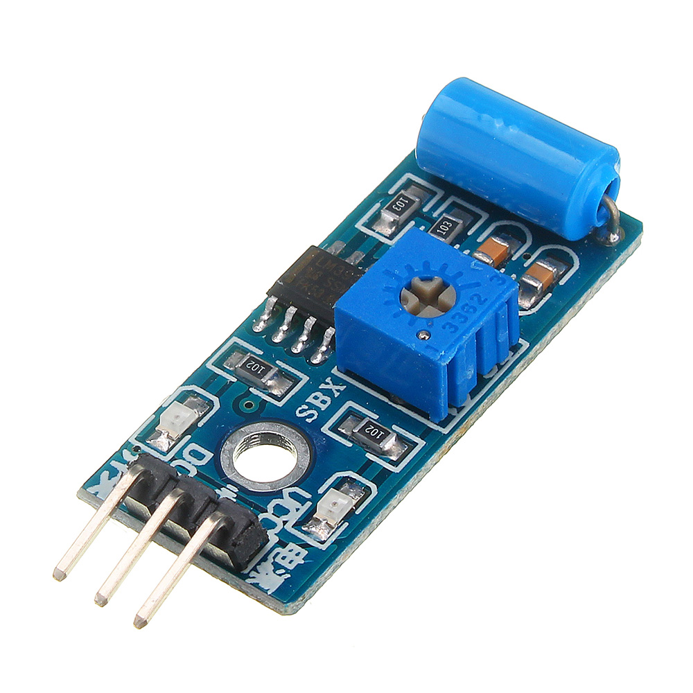
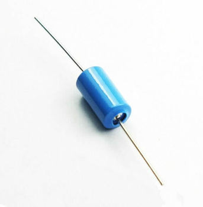
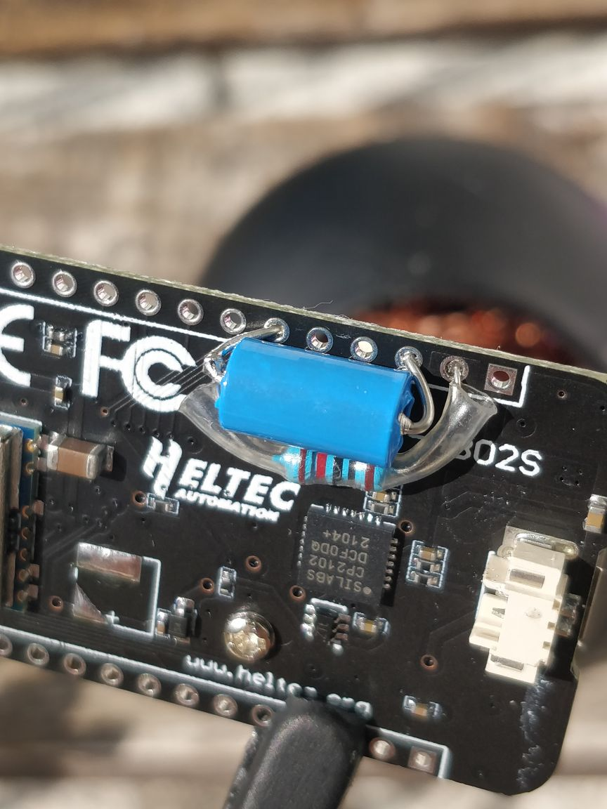

# Overview
**CubeCell-GPS Helium Mapper** based on https://github.com/jas-williams/CubeCell-Helium-Mapper.git with the following improvements:

- No longer stopping the GPS after each SEND, allowing for faster GPS Fix next time. 
- Constant reading of the GPS on a timer (default every 1s) to keep it &quot;hot&quot;
- Added counters on the JOIN and GPS Fix Wait screens so the user could see how long it takes (could be used to compare antennas, like for example the difference between internal and external GPS antenna is clearly visible, but now you can roughly measure in seconds how much faster you get a fix with one GPS antenna vs another)
- Added Battery Level display on some screens (later added to Jas Williams version as well)
- Distance based movement detection - sends only if the distance from the last send is greater than x meters
- Menu mode - short press on the USR button displays a menu, another short press cycles through the options, long press activates the current option
- Screen off mode, activated from the menu - attempt to improve battery life
- Increase/decrease moving update rate from the menu (by decreasing/increasing the x meter distance)
- Tracker mode, activated from the menu - stores and sends last known location on wake up from sleep. Note - there is new decoder to support that functionality.
- Auto sleep if no movement

This device is used for mapping the Helium networks LoRaWAN coverage. 

The initial settings are - read GPS every 1 second, send every 25 meters, auto sleep if no movement for 5 min. Please feel free to increase the 25m distance, if you think it is consuming too much DC. 

The Sleep mode (activatd from the menu or from auto-sleep) turns off the GPS and the radio. 

Pressing the user button while in sleep mode wakes it up and resumes normal operation.

There is also an option for auto-wakeup by vibration (additional sensor required).

&quot;Non-stop mode&quot; menu option - this will disable the timers that would put the device to sleep for inactivity (no gps found, no vibration for x seconds, no send for x seconds). Useful if you are about to go on a bus/train/tube/metro ride that goes underground and loses GPS or stops for long periods and you don&apos;t want your device to go to sleep and stop sending. 

&quot;Send now&quot; menu option - in case you haven&apos;t moved much but you want to send and see if hotspot will receive it.

Revision changes:
- Added "Next DR" menu to cycle through different data rates. Default data rate changed to DR1 (from DR0). (Known issue - Debug info screen shows the DR from the last send, so if you switch the DR and check the debug info it will show the old value until you send something)
- Added downlink handling code - available commands are - "EQ==" (Enable tracker mode), "EA==" (Disable tracker mode), "IQ==" (Enable non-stop mode), "IA==" (Disable non-stop mode), "QDI=" (Change distance to 50m), "QGQ=" (Change distance to 100m). You can combine multiple commands. First byte, top half is the command, lower half is the value, except for the distance command which requires a second byte. Look at the code for more details. 
- Changed the behavior of the menu when you re-enter it - it now opens to the last used menu option instead of resetting back to the first one. 
- Enabled AT commands, added a custom AT command for enabling GPS messages output on the serial console for debugging, switched GPS comm speed to 115200 and decreased the number of NMEA message types requested from the GPS in order to decrease the amount of irrelevant chatter and the time we have to spend on reading it
- merged GPSTimer branch into master (the old version was saved in branch OldTimerBased) which brings the following changes: 
	- GPS read on timer to keep it hot 
	- Distance based send (no longer timer based). We no loger have moving and stopped update rates. We no longer collect x speed readings and calculate average speed to detect movement ot stop.
	- The Faster/Slower Upd menu options add or subtract 10m from the current value every time you click them with a hard limit of 10 min and 500 max. You can use that to test various values and once you find one that suits you - modify the default in the code and flash again.
	- Non-stop mode
	- &quot;Send now&quot; option in the menu
	- Removed battery percent display option, 
	- Removed the reset GPS option from the menu (it was just for debut/testing purposes)
- Added menu auto-close
- Fixed a bug in Tracker mode - after wake up, go to SEND instead of CYCLE
- Removed the randomizaton of the send interval, made MAX_GPS_WAIT optional, fixed issue with the vibration handling
- Tracker mode
- Added option to disable wake up on vibration when sleep was activated from the menu
- Optimized data frame to fit GPS lat/long in 6 bytes instead of 8 and use the new availabe 2 bytes for altitude
- Added option to send data in CayenneLPP format
- Added Menu mode
- Improved movement detection (min stop cycles before switching to stopped update rate). Added battery level display.
- Added vibration sensor wake up. 
- Added Auto Sleep after stopped for too long. 
- Added Auto Sleep when wait for GPS is too long.
- Added Air530Z GPS support for board version 1.1

# Uploading the code

**Note: If you prefer to use Arduino IDE, just take the \src\main.cpp file and rename it to "something".ino (for example CubeCell_GPS_Helium_Mapper.ino)**

Install Serial Driver. Find directions [here.](https://heltec-automation-docs.readthedocs.io/en/latest/general/establish_serial_connection.html)

Install [Visual Studio Code](https://code.visualstudio.com/Download). If you are using Windows, make sure the pick the System installer, not the User installer.

(Optional) When the Get Started wizard prompts you to install language extensions - install the C/C++ extension.

Install Git from https://git-scm.com/downloads or https://github.com/git-guides/install-git

Reboot your computer for the path changes to take effect.

Install the GitHub Pull Requests and Issues extension from the link [here](https://code.visualstudio.com/docs/editor/github).

Install [PlatformIO IDE](https://marketplace.visualstudio.com/items?itemName=platformio.platformio-ide)

Once you are in Visual Studio Code, go to the Explorer and click Clone Repository. Paste the URL you got from GitHub, by clicking on the Code button. When prompted for location, if you want to use the default location (and you are using Windows) do the following - select your Documents folder, if there is no PlatformIO sub-folder in it - create one and enter it, then if there is no Projects sub-folder inside - create it and select it as the location for the cloned repository. So the final location would be %userprofile%\Documents\PlatformIO\Projects

Open the cloned folder

Open the main.cpp from src sub-folder and wait. Initially the #include directives at the top will have squiggly lines as unknown, but relatively soon (within 5 min) PlatformIO will detect and install the required platform and libraries. If you don't want to wait, open PlatformIO and go to Platforms and install "ASR Microelectronics ASR650x". You can do that as a step right after installing PlatformIO.

Comment out/uncomment the appropriate line for your board version (for GPS Air530 or Air530Z) in main.cpp.

Comment out/uncomment the #define lines for VIBR_SENSOR, VIBR_WAKE_FROM_SLEEP, MENU_SLEEP_DISABLE_VIBR_WAKEUP, MAX_GPS_WAIT, MAX_STOPPED_CYCLES and edit the values for the timers if desired.

Enter DevEUI(msb), AppEUI(msb), and AppKey(msb) from Helium Console, at the respective places in main.cpp. The values must be in MSB format. From console press the expand button to get the ID's as shown below.


```
uint8_t devEui[] = { 0x00, 0x00, 0x00, 0x00, 0x00, 0x00, 0x00, 0x00 };
uint8_t appEui[] = { 0x00, 0x00, 0x00, 0x00, 0x00, 0x00, 0x00, 0x00 };
uint8_t appKey[] = { 0x00, 0x00, 0x00, 0x00, 0x00, 0x00, 0x00, 0x00, 0x00, 0x00, 0x00, 0x00, 0x00, 0x00, 0x00, 0x00 };
```

Modify platformio.ini if you need to change LoRaWAN settings like region.

Click the PlatformIO: Build button. Address any compile errors and repeat until you get a clean build.

Connect the CubeCell to the computer with USB cable.

Click the PlatformIO: Upload button.

# Debug using Serial connection via USB

(Optional) Uncomment the line enabling the DEBUG code and build again.
```
//#define DEBUG // Enable/Disable debug output over the serial console
```
Click the PlatformIO: Serial Monitor button

# Setting up Console

In [Helium Console](https://console.helium.com/) create a new function call it Heltec decoder => Type Decoder => Custom Script

Copy and paste the decoder into the custom script pane

```
function Decoder(bytes, port) {
  var decoded = {};
  
  var latitude = ((bytes[0]<<16)>>>0) + ((bytes[1]<<8)>>>0) + bytes[2];
  latitude = (latitude / 16777215.0 * 180) - 90;
  
  var longitude = ((bytes[3]<<16)>>>0) + ((bytes[4]<<8)>>>0) + bytes[5];
  longitude = (longitude / 16777215.0 * 360) - 180;
  
  switch (port)
  {
    case 2:
      decoded.latitude = latitude;
      decoded.longitude = longitude; 
      
      var altValue = ((bytes[6]<<8)>>>0) + bytes[7];
      var sign = bytes[6] & (1 << 7);
      if(sign) decoded.altitude = 0xFFFF0000 | altValue;
      else decoded.altitude = altValue;
      
      decoded.speed = parseFloat((((bytes[8]))/1.609).toFixed(2));
      decoded.battery = parseFloat((bytes[9]/100 + 2).toFixed(2));
      decoded.sats = bytes[10];
      decoded.accuracy = 2.5;
      break;
    case 3:
      decoded.last_latitude = latitude;
      decoded.last_longitude = longitude; 
      break;
  }
     
  return decoded;  
}

```

Create two integrations one for CARGO (optional) and one for MAPPERS.
For CARGO use the available prebuilt integration. 
For MAPPERS use a custom HTTP integration with POST Endpoint URL https://mappers.helium.com/api/v1/ingest/uplink

Go to Flows and from the Nodes menu add your device, decoder function and integrations. 
Connect the device to the decoder. 
Connect the decoder to the integrations.

Useful links:

[Mappers](http://mappers.helium.com) and [Cargo](https://cargo.helium.com)

[Integration information with Mappers](https://docs.helium.com/use-the-network/coverage-mapping/mappers-api/)

[Integration information for Cargo](https://docs.helium.com/use-the-network/console/integrations/cargo/)

# Vibration sensor
Theoretically, any sensor that can provide digital output could be used.

For now, we have information about these 2 options:

- SW-420 board


If you want to use the board, you have to connect it the following way:
```
VCC - VDD
GND - GND
DO  - GPIOx where you pick which one to use, GPIO7 is the closest one on the CubeCell board
```

- SW-420 bare sensor



If you decide to use just the sensor, you connect it between the VDD and 
the GPIO pin you want to use (GPIO5 is most convenient if you want to put the sensor directly on the board).
And you need to add a 10k resistor between GND and the chosen GPIO pin. 


